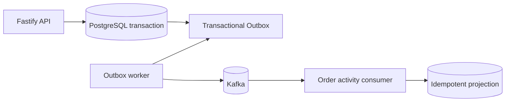

# AFDS Nest Starter

[](https://github.com/hyojii00/afds-nest-starter/actions/workflows/verify.yml)

An agent-ready NestJS starter that demonstrates how I use AI as part of a disciplined software delivery loop. It combines domain-driven design, event-driven integration, executable tests, and an Agent-First Documentation System (AFDS).

The repository intentionally implements one small ordering flow. Its purpose is to make engineering decisions, boundaries, and evidence easy to inspect—not to provide a feature-complete commerce product.



## What this demonstrates

- A pnpm workspace with explicit application and bounded-context boundaries.
- A Fastify HTTP adapter, Terminus health checks, and SWC production builds.
- A framework-free `Order` aggregate with tested invariants.
- Atomic order persistence and integration-event creation through a PostgreSQL Transactional Outbox.
- A separately runnable Outbox worker that publishes to Kafka with retry, stale-lock recovery, and at-least-once delivery semantics.
- An independently runnable Kafka consumer that maintains an idempotent `order_activity` projection.
- AFDS owner documents that separate durable truth from temporary AI sessions and task logs.
- A verification loop that treats AI output as untrusted until code, tests, documentation, and dependency rules agree.

## Repository shape

| Path | Responsibility |
| --- | --- |
| `apps/api` | NestJS HTTP bootstrap, health checks, validation, and OpenAPI |
| `apps/outbox-worker` | Independently runnable Outbox relay and Kafka publisher |
| `apps/order-activity-consumer` | Kafka consumer and idempotent order-activity projection |
| `packages/ordering` | Ordering bounded context and its adapters |
| `packages/platform` | PostgreSQL lifecycle and generic Outbox infrastructure |

See the [system architecture](docs/arch/system.md), [ordering behavior specification](docs/specs/ordering.md), and [repository map](MAP.md) for the durable design.

## Quick start

Prerequisites: fnm, Docker, and Corepack.

```bash
fnm use --install-if-missing
corepack enable
pnpm install --frozen-lockfile
cp .env.example .env
pnpm demo
```

With dependencies and Docker images cached, the demo normally completes within 60 seconds; the first run may take longer while images and packages download. It prints evidence from every durable boundary:

```text
✓ API          201 order=<order-id>
✓ Outbox       event=<event-id> status=PUBLISHED attempts=1
✓ Kafka        event=<event-id> delivered to order-activity consumer
✓ Projection   event=<event-id> order=<order-id> total=5000
```

The command stops the three application processes and leaves Docker and the database evidence running. For manual development, use the separate API, worker, and consumer commands in the [local development runbook](docs/runbooks/local-development.md). Open `http://localhost:3000/docs` while the API is running.

## Verification

```bash
pnpm verify
```

This runs formatting, linting, dependency-boundary checks, TypeScript declaration checking, unit tests, Docker-backed integration and E2E tests, AFDS document validation, and the SWC production build. See [CONTRIBUTING.md](CONTRIBUTING.md) for focused commands.

## How AI fits

AI can explore, propose, implement, and review, but repository-owned requirements and executable checks decide whether a change is acceptable. The workflow is:

1. Locate the durable owner through `AGENTS.md` and `MAP.md`.
2. State the intended behavior and measurable success criteria.
3. Change the smallest relevant code and owner documents.
4. Run the narrowest meaningful check, use exact failures as feedback, and repeat.
5. Review the final diff and report AI scope, human decisions, validation, and documentation impact.

The full protocol is owned by [AI-assisted development](docs/guidelines/ai-assisted-development.md). See [portfolio-readiness PR #2](https://github.com/hyojii00/afds-nest-starter/pull/2) for a concrete issue-to-PR example with AI scope, human decisions, validation, and residual risk. Raw prompt transcripts, temporary plans, and validation logs do not become durable repository truth.

## Scope boundaries

This starter does not include authentication, payments, inventory, shipping, event sourcing, full CQRS, cloud deployment, or runtime LLM features. These would obscure the architecture being demonstrated and should be introduced only for a concrete requirement.

## License

MIT. See [LICENSE](LICENSE).
