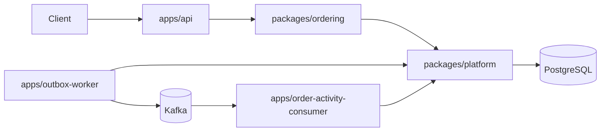
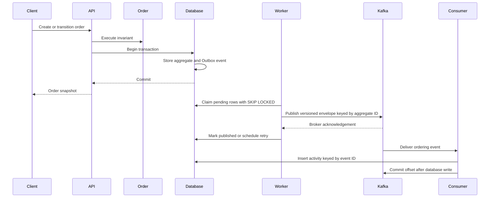

# System Architecture

The repository uses context-oriented pnpm packages. Workspace boundaries make application dependencies explicit; layer boundaries inside `ordering` are enforced by dependency-cruiser.

The ordering domain and application layers are framework-free. Presentation and persistence adapters may depend inward. Platform provides generic database lifecycle and Outbox relay behavior and must never depend on ordering.

The API uses NestJS with the Fastify adapter. Nest Terminus owns the liveness and PostgreSQL readiness response contract. TypeScript performs type and declaration checks, while SWC emits production JavaScript for every workspace package and application.

## Command and event flow

The Outbox relay claims rows by changing them from `PENDING` to `PROCESSING` in a short transaction. A crash after external publish but before `PUBLISHED` can cause redelivery after stale-lock recovery; delivery is therefore at least once and consumers must deduplicate by event ID.

The worker publishes versioned JSON envelopes to the configured Kafka topic and uses the aggregate ID as the record key, preserving order for one aggregate within a topic partition. The relay marks a row `PUBLISHED` only after Kafka acknowledges the record.

The order-activity consumer ensures its topic exists before subscribing, uses its own consumer group, and commits an offset only after the projection write succeeds. `order_activity.event_id` is the primary key and duplicate deliveries use conflict-safe insertion, so replaying the same event does not duplicate the projection. The local broker is a single-node KRaft deployment; production replication, authentication, TLS, and topic policy remain deployment concerns.
