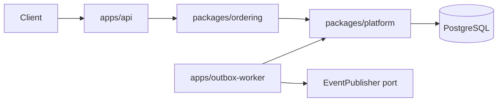
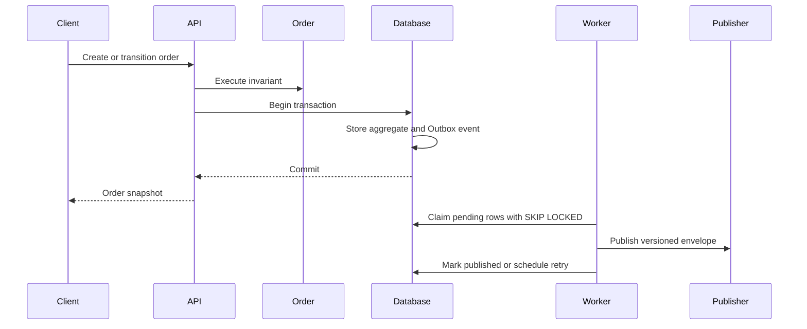

# System Architecture

The repository uses context-oriented pnpm packages. Workspace boundaries make application dependencies explicit; layer boundaries inside `ordering` are enforced by dependency-cruiser.

The ordering domain and application layers are framework-free. Presentation and persistence adapters may depend inward. Platform provides generic database lifecycle and Outbox relay behavior and must never depend on ordering.

The API uses NestJS with the Fastify adapter. Nest Terminus owns the liveness and PostgreSQL readiness response contract. TypeScript performs type and declaration checks, while SWC emits production JavaScript for every workspace package and application.

## Command and event flow

The Outbox relay claims rows by changing them from `PENDING` to `PROCESSING` in a short transaction. A crash after external publish but before `PUBLISHED` can cause redelivery after stale-lock recovery; delivery is therefore at least once and consumers must deduplicate by event ID.

The initial publisher writes structured events to application logs. A broker adapter may replace it without changing the ordering context or relay state machine.
